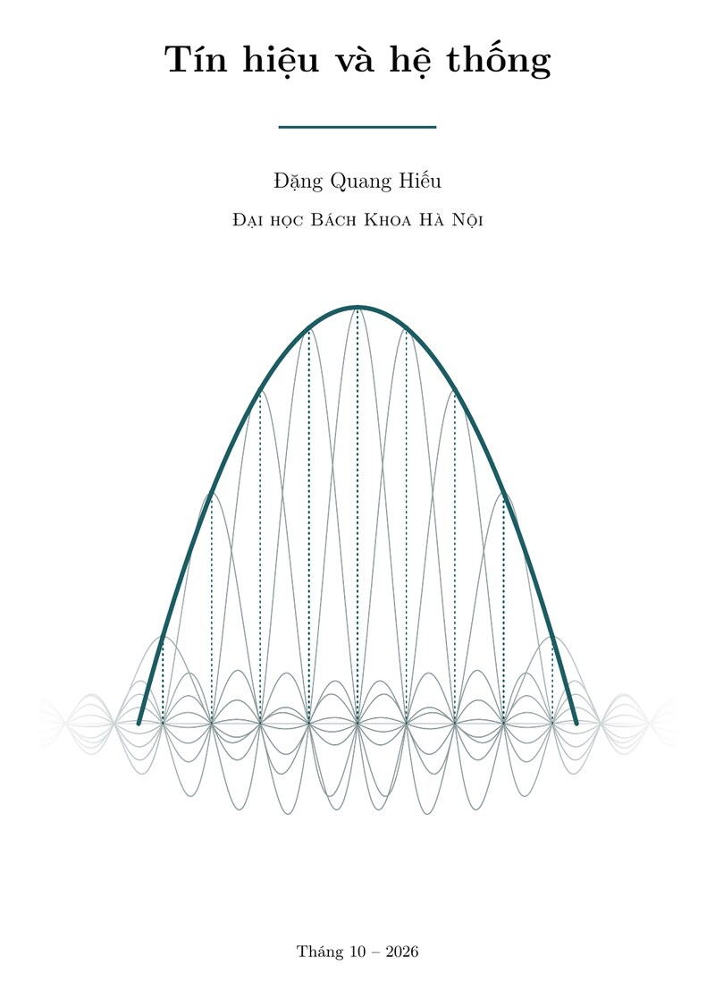

## Tín hiệu và hệ thống 

Môn *Tín hiệu và hệ thống* (THHT) được ĐHBK HN đưa vào chương trình giảng dạy từ đầu những năm 2010. Tôi được giao nhiệm vụ soạn đề cương để dạy sinh viên năm 2-3 với vai trò là môn cơ sở của ngành Điện tử - Viễn thông. Đến nay đã có đủ bài giảng và slides cho môn học. 

---

### Bài giảng Tín hiệu và hệ thống

Tôi đã hoàn thành phiên bản đầu tiên (2026-10-6) của cuốn *Tín hiệu và hệ thống*. 

Tải về [ở đây](https://github.com/dangquanghieu/book-thht/releases/latest/download/TinHieuHeThong.pdf)

---

[Slides cho môn THHT](https://www.dropbox.com/scl/fo/no18vz6yqwm11rpaqrxs1/AKRt0rDDmsb-oFh06nUKAr4?rlkey=4dk1h8p1mqn1m7pe8syg1p7y6&st=pbppgd20&dl=0) 

### Tóm tắt nội dung các slides:
1. Những khái niệm cơ bản về tín hiệu và hệ thống. Chia thành 2 loại: liên tục và rời rạc theo thời gian. Biểu diễn tín hiệu, các phép toán trên tín hiệu. Năng lượng, công suất. Xung đơn vị, nhảy đơn vị. Thuộc tính tuyến tính, ổn định, nhân quả của hệ thống.
2. Hệ thống LTI, phép chập (tổng chập và tích phân chập), đáp ứng xung. Đáp ứng nhảy. Phương trình vi phân / sai phân tuyến tính hệ số hằng. Sơ đồ thực hiện hệ thống. Phép tương quan.
3. Các phép biến đổi Fourier và chuỗi Fourier: FS, DTFS, FT, DTFT. Khái niệm phổ: biên độ, pha. Các tính chất. Đáp ứng tần số, bộ lọc. 
4. Định lý lấy mẫu. 
5. Biến đổi z: thuận, ngược. Miền hội tụ. Các tính chất. Phân tích hệ thống trên miền z, vai trò trung tâm của hàm truyền.
6. Biến đổi Laplace: thuận, ngược. Miền hội tụ. Các tính chất. Phân tích hệ thống trên miền s, đồ thị Bode.
7. Hệ thống thông tin. Điều chế AM, giải điều chế. Nguyên lí thông tin số.

Tiếp nối môn THHT sẽ là môn "Xử lý tín hiệu số". 
